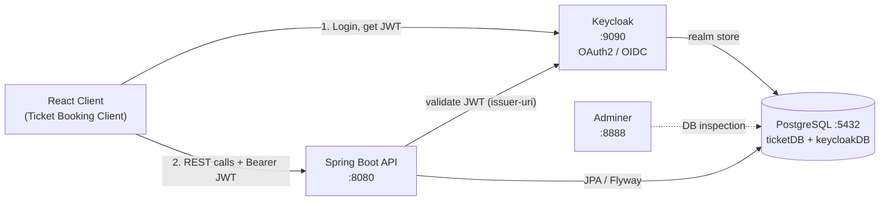

# Ticket Booking Platform

> A secure, role-based event ticketing backend that lets organizers publish events, attendees buy tickets, and staff validate QR codes at the door.

<!-- Replace the badge URLs below once CI, license, and release tags are set up -->


---

## Table of Contents

- [What Is This Project](#what-is-this-project)
- [Demo](#demo)
- [Features](#-features)
- [Architecture](#-architecture)
- [Tech Stack](#-tech-stack)
- [Getting Started](#-getting-started)
  - [Prerequisites](#prerequisites)
  - [Installation](#installation)
  - [Configuration](#configuration)
- [Usage](#-usage)
- [API Overview](#api-overview)
- [Contributing](#-contributing)
- [Reporting Issues](#reporting-issues)
- [License](#-license)
- [Contact](#-contact)

---

## What Is This Project

The Ticket Booking Platform is the **backend service** for an event ticketing system. It exposes a REST API that models the full lifecycle of an event:

1. An **organizer** creates an event, defines ticket types (name, price, quantity), and publishes it.
2. An **attendee** browses published events and purchases a ticket. Each purchase generates a unique QR code.
3. **Staff** scan and validate those QR codes at the venue, marking tickets as used.

Identity and access are handled by Keycloak (OAuth2 / OpenID Connect), so the API itself stays stateless and only trusts signed JWTs. Ticket purchases are concurrency-safe: a pessimistic database lock prevents overselling when many people buy the last ticket at the same time.

> Note: This repository is the backend only. The React frontend lives in a separate project (`Ticket Booking Client`).

---

## Demo

Watch the walkthrough on YouTube:

**[▶ Watch the demo](https://youtube.com/YOUR_DEMO_LINK_HERE)**

<!-- Replace YOUR_DEMO_LINK_HERE with the real video URL once uploaded -->

---

## ✨ Features

- **Role-based access control** for organizers, attendees, and staff, enforced through Keycloak realm roles and Spring Security.
- **Full event lifecycle management**: create, update, list, publish, and delete events, each with multiple configurable ticket types.
- **Concurrency-safe ticket purchasing** using a pessimistic write lock, so a limited ticket allocation can never be oversold under load.
- **QR-code ticketing** generated per ticket (via ZXing) and served as an image, with a validation flow to check tickets in at the door.
- **Schema-as-code migrations** managed by Flyway, with Hibernate set to `validate` so the running app can never silently drift from the migrated schema.

---

## 🏗 Architecture

The system is a stateless Spring Boot API sitting behind Keycloak for auth, backed by a single PostgreSQL instance that hosts two logical databases.



**Rough draft for your diagram tool (Figma / Canva / Freeform):**

```
+------------------+        login (OAuth2)        +------------------+
|  React Client    | ---------------------------> |     Keycloak     |
| (browser :5173)  |                              |   realm + JWT    |
+------------------+                              +------------------+
        |                                                  ^
        | REST + Bearer JWT                                | validate token
        v                                                  |
+---------------------------------------------------------------+
|                 Spring Boot API  (:8080)                      |
|                                                               |
|  Controllers  ->  Services  ->  Repositories (Spring Data)    |
|   - Event         - EventService     - JPA / Hibernate        |
|   - Ticket        - TicketService    - Flyway migrations      |
|   - TicketType    - QrCodeService    - Pessimistic locking    |
|                                                               |
|  Security: JwtAuthenticationConverter -> ROLE_* authorities   |
+---------------------------------------------------------------+
        |                                    |
        | JPA                                | seed/inspect
        v                                    v
+------------------+                 +------------------+
|   PostgreSQL     |                 |     Adminer      |
| ticketDB         | <-------------- |  DB web UI :8888 |
| keycloakDB       |                 +------------------+
+------------------+

Domain model:
  User (organizer / attendee / staff)
    |
    +-- organizes --> Event --< TicketType --< Ticket --< QrCode
                                                   |
                                                   +--< TicketValidation
```

---

## 🛠 Tech Stack

**Language & Runtime**
- `Java 25`
- `Maven` (via the bundled `./mvnw` wrapper, no system Maven required)

**Backend Framework**
- `Spring Boot 4.0.6`
- `Spring Web (MVC)` for the REST layer
- `Spring Data JPA` / `Hibernate` for persistence
- `Spring Validation` for request validation

**Security & Identity**
- `Spring Security` with `OAuth2 Resource Server`
- `Keycloak 26` as the identity provider (OAuth2 / OpenID Connect)

**Database & Migrations**
- `PostgreSQL` (primary datastore)
- `Flyway` for versioned schema migrations
- `H2` (in-memory, test scope only)

**Utilities & Tooling**
- `MapStruct` for entity to DTO mapping
- `Lombok` for boilerplate reduction
- `ZXing` for QR-code generation

**DevOps**
- `Docker` / `Docker Compose` (PostgreSQL, Keycloak, Adminer)
- `Adminer` for database inspection

---

## 🚀 Getting Started

### Prerequisites

| Tool | Version | Notes |
|---|---|---|
| Java (JDK) | 25 | Required by `pom.xml` (`java.version=25`) |
| Docker Desktop | 29.x or later | Must be running before `docker compose up` |
| Maven | Not needed | Use the bundled `./mvnw` wrapper |
| Network access | First build only | Needed to download dependencies once |

### Installation

```bash
# 1. Clone the repository
git clone https://github.com/da-gohil/Ticket-Booking-Platform.git
cd "Ticket Booking Platform"

# 2. Start the infrastructure (PostgreSQL + Keycloak + Adminer)
docker compose up -d

# 3. Wait until the database reports "healthy"
docker compose ps

# 4. Build the backend (compiles and runs tests)
./mvnw clean package
```

> The `ticketDB` database is created automatically on first boot by `init-db.sh`.
> Keycloak's own store (`keycloakDB`) is created by the Postgres container.

### Configuration

Configuration lives in `src/main/resources/application.properties`. The one value you will typically override is the database password, supplied through an environment variable.

**Environment variables**

| Variable | Default | Description |
|---|---|---|
| `DB_PG_PASSWORD` | `changeInProd!` | PostgreSQL password for the app's datasource. Set this in any non-local environment. |

```bash
# Example: override the DB password before running
export DB_PG_PASSWORD=[YOUR_SECURE_PASSWORD]
```

**One-time Keycloak setup** (via the admin console at `http://localhost:9090`, login `admin` / `admin`):

1. Create realm `event-ticket-platform`.
2. Create a public client `event-ticket-platform-app` with:
   - Valid redirect URI: `http://localhost:5173/callback`
   - Web origin: `http://localhost:5173`
3. Create realm roles named `ROLE_ORGANIZER`, `ROLE_ATTENDEE`, and `ROLE_STAFF`.
   The backend keeps only roles prefixed with `ROLE_`, and `SecurityConfig` checks `hasRole("ORGANIZER")`, so the prefix matters.
4. Create users and assign the matching roles.

> Full step-by-step operational notes, including known setup gaps, are in [`RUNBOOK.md`](./RUNBOOK.md).

---

## 💻 Usage

**Run the API in development:**

```bash
./mvnw spring-boot:run
```

The API starts on `http://localhost:8080`.

**Run the test suite:**

```bash
./mvnw test
```

**Smoke-test the running API:**

```bash
# Public endpoint, no auth required -> 200 with a page of published events
curl -s "http://localhost:8080/api/v1/published-events?page=0&size=5"

# Protected endpoint, no auth -> 401 Unauthorized
curl -i "http://localhost:8080/api/v1/tickets"
```

**Stop everything:**

```bash
docker compose down       # keep data
docker compose down -v    # also wipe DB + Keycloak volumes (full reset)
```

<!-- Add a screenshot or GIF of the API in action (e.g. Postman, Adminer, or the client) below -->
> _Screenshot / GIF placeholder: add a demo capture here._

### API Overview

| Method | Path | Access | Purpose |
|---|---|---|---|
| `GET` | `/api/v1/published-events` | Public | List published events |
| `GET` | `/api/v1/published-events/{id}` | Public | View a published event |
| `POST` | `/api/v1/events` | Organizer | Create an event |
| `PUT` | `/api/v1/events/{id}` | Organizer | Update an event |
| `DELETE` | `/api/v1/events/{id}` | Organizer | Delete an event |
| `GET` | `/api/v1/events` | Organizer | List the organizer's events |
| `POST` | `/api/v1/ticket-types/{id}/tickets` | Authenticated | Purchase a ticket |
| `GET` | `/api/v1/tickets` | Authenticated | List the user's tickets |
| `GET` | `/api/v1/tickets/{id}/qr-codes` | Authenticated | Fetch a ticket's QR code image |

---

## 🤝 Contributing

Contributions are welcome. To keep the history clean and reviews smooth:

1. **Fork** the repository and clone your fork.
2. **Create a branch** off `main` using a descriptive name:
   ```bash
   git checkout -b feat/add-refund-endpoint
   ```
   Use prefixes such as `feat/`, `fix/`, `docs/`, or `chore/`.
3. **Commit** in small, focused units with clear messages.
4. **Run the build and tests** before pushing:
   ```bash
   ./mvnw clean package
   ```
5. **Open a pull request** against `main`. Describe what changed and why, and link any related issue.

Please keep pull requests focused on a single concern so they are easy to review.

### Reporting Issues

Found a bug or have a feature request? Open a GitHub issue and include:

- A clear title and description of the problem or request.
- Steps to reproduce (for bugs), plus expected vs. actual behavior.
- Environment details (OS, Java version, Docker version).
- Relevant logs or stack traces.

Use labels such as `bug`, `enhancement`, or `question` where possible.

---

## 📄 License

Distributed under the MIT License. See the `LICENSE` file for full details.

<!-- Add a LICENSE file at the repository root if one is not present yet -->

---

## 📬 Contact

**Darshan Gohil**

- Email: gohil.da@northeastern.edu
- GitHub: [@da-gohil](https://github.com/da-gohil)
- Project link: [Ticket-Booking-Platform](https://github.com/da-gohil/Ticket-Booking-Platform)

For questions or support, open an issue or reach out by email.
